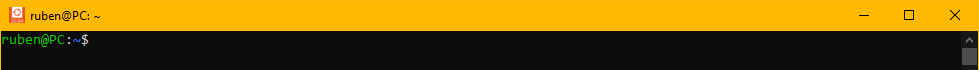

# Instalador de Docker en Ubuntu💻🐋

<details>
  <summary><b>Contenido</b></summary>

- [Instalador de Docker en Ubuntu💻🐋](#instalador-de-docker-en-ubuntu)
  - [Introducción 🧐](#introducción-)
    - [🔗¿Qué es Docker?](#qué-es-docker)
    - [🔗¿Qué es Docker Compose?](#qué-es-docker-compose)
  - [Instalación de Docker y Docker Compose 👨‍💻](#instalación-de-docker-y-docker-compose-)
    - [Pasos para la instalación 👣](#pasos-para-la-instalación-)
  - [Explicación de los comandos del Script 🔎](#explicación-de-los-comandos-del-script-)
  - [Comprobar instalación 👍](#comprobar-instalación-)
  - [Desinstalar Docker ❌](#desinstalar-docker-)

</details>

## Introducción 🧐

### [🔗](https://nuvalab.com/comandos-principales-en-docker/#:~:text=0-,%C2%BFQu%C3%A9%20es%20Docker%3F,-Imagina%20que%20quieres)¿Qué es Docker?

**Docker** es una aplicación que simplifica el proceso de gestión de procesos de aplicación en contenedores. Los **contenedores** le permiten ejecutar sus aplicaciones en procesos aislados de recursos. Son similares a las máquinas virtuales, pero los contenedores son más portátiles, más amigables con los recursos y más dependientes del sistema operativo host.

### [🔗](https://imaginaformacion.com/tutoriales/que-es-docker-compose#:~:text=2024%2D03%2D14-,%C2%BFQu%C3%A9%20es%20Docker%20Compose%3F,-Docker%20Compose%20es)¿Qué es Docker Compose?

**Docker Compose** es una herramienta que te permite ejecutar entornos de aplicaciones de varios contenedores basados en definiciones establecidas en un archivo **YAML**. Utiliza definiciones de servicio para crear entornos totalmente personalizables con varios contenedores que pueden compartir redes y volúmenes de datos.

</br>

> 👌 Por lo tanto, Docker es una herramienta que nos ayudara a crear contenedores donde se alojaran nuestras aplicaciones y servicios ocupados. Ademas, Docker compose nos permitirá gestionar los contenedores que conforman nuestra aplicación, como la comunicación entre contenedores, almacenamiento, demanda, y otros.
> Otra gran ventaja es poder compartir nuestro proyecto con otras personas, sin preocuparnos en una ejecución fallida por sistemas operativos diferentes, dependencias, recurso, entre otros.

## Instalación de Docker y Docker Compose 👨‍💻

Para la instalación se ejecutara un Bash Script el cual contendrá los comandos que se ejecutaran para una instalación correcta de Docker en un servidor **Ubuntu 20.04**, Docker Compose es un plugin incluido en la instalación de Docker por lo que no se tendrá que hacer algún otro paso.

**Prerrequisitos**📝:

- Un servidor Ubuntu 20.04

> 📝 **Nota**: <br> Para asegurarnos de obtener la última versión de Docker, instalaremos desde el repositorio oficial de Docker. Para ello, agregaremos un nuevo origen de paquete, agregaremos la clave GPG de Docker para asegurarnos de que las descargas son válidas.

### Pasos para la instalación 👣

1. Abrir el servidor de Ubuntu y colocarse en la carpeta donde se clonara este repositorio.
   
2. Clonar este repositorio.
   
3. Abrir el repositorio y buscar el archivo **_Docker_Installer.sh_**
   
4. Ejecutar el instalador con el siguiente comando.
   ```bash
    bash Docker_Installer.sh
   ```
5. Se ejecutaran los comandos del script.
   
6. Terminada la ejecución verifica la correcta instalación con el siguiente comando.
   ```bash
   sudo systemctl status docker
   ```
   Una instalación exitosa se vería así:
   

## Explicación de los comandos del Script 🔎

1. Iniciamos declarando el interprete shell bash, seguido de un mensaje que se desplegara al iniciar la instalación, seguido de una espera por entrada de teclado (enter).

   ```bash
      #!/bin/bash
      clear
      msg="
            =====================================================
                     Instalador de Docker y Docker Compose
            =====================================================
      "

      tput setaf 10;
      printf "$msg"
      tput setaf 7;

      printf "$(tput setaf 202) \n\n Se iniciara la instalación de docker\n"
      read -r -s -p " Presiona enter para continuar..."
   ```

2. Acontinuación se desinstalaran los paquetes en conflicto de posibles versiones de docker instaladas anteriormente.
   ```bash
   for pkg in docker.io docker-doc docker-compose docker-compose-v2 podman-docker containerd runc; do sudo apt-get remove $pkg; done
   ```
3. Ahora se instalaran algunos paquetes de requisitos previos que permiten a apt utilizar paquetes a través de HTTPS:
   ```bash
   sudo apt install apt-transport-https ca-certificates curl gnupg-agent software-properties-common
   ```
4. Se añade la clave GPG del repositorio oficial de Docker a tu sistema
   ```bash
   curl -fsSL https://download.docker.com/linux/ubuntu/gpg | sudo apt-key add -
   ```
5. Se agrega el repositorio de Docker a las fuentes de APT
   ```bash
   sudo add-apt-repository "deb [arch=amd64] https://download.docker.com/linux/ubuntu focal stable"
   ```
6. Asegurarse que se esta instalando desde el repositorio de Docker en lugar del repositorio predeterminado de Ubuntu
   ```bash
   apt-cache policy docker-ce
   ```
7. Se instala Docker:

   ```bash
   sudo apt install docker-ce
   ```

   > Una vez terminado, se habrá instalado exitosamente Docker y Docker compose.
   > Los siguientes pasos son para ejecutar el comando `Docker` sin `sudo`.

8. Se añade el nombre de usuario al grupo docker y se reinicia la session de shell
   ```bash
   sudo usermod -aG docker ${USER}
   su - ${USER}
   ```

## Comprobar instalación 👍

Para comprobar una instalación exitosa podemos ejecutar los siguientes comandos en la shell

```bash
docker --version
```

```bash
docker compose --version
```

También podemos comprobar su funcionamiento de docker levantando un contenedor

```bash
docker run hello-world
```

Si se necesita verificar también el funcionamiento de Docker Compose podemos realizar el pequeño ejemplo del siguiente [enlace](https://www.digitalocean.com/community/tutorials/how-to-install-and-use-docker-compose-on-ubuntu-20-04#:~:text=with%20this%20tool.-,Step%202%20%E2%80%94%20Setting%20Up%20a%20docker%2Dcompose.yml%20File,-To%20demonstrate%20how).

## Desinstalar Docker ❌

En el mismo repositorio se encuentra un script para desinstalar Docker, el cual eliminara docker y complementos instalados en el servidor, ademas con la opción de eliminar o no, contenedores, volumes e imágenes que se encuentren en el servidor (si se encuentran guardados en la ruta predeterminada).

1. Abrir el repositorio y buscar el archivo **_Docker_Uninstaller.sh_**
   
2. Ejecutar el desinstalador con el siguiente comando.
   ```bash
    bash Docker_Uninstaller.sh
   ```
3. Se ejecutaran los comandos del script.
   
4. Terminada la ejecución verifica la correcta desinstalacion con el siguiente comando.
   ```bash
   sudo docker --version
   ```
   Una desinstalacion exitosa se vería así:
   
